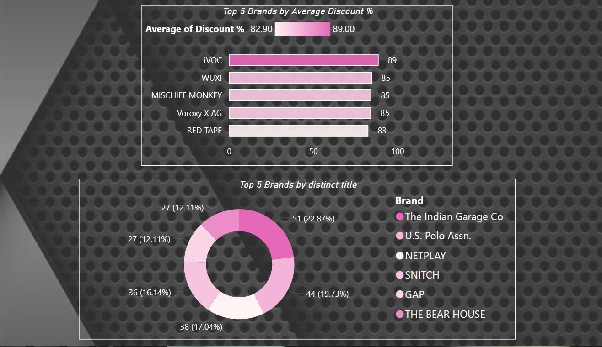
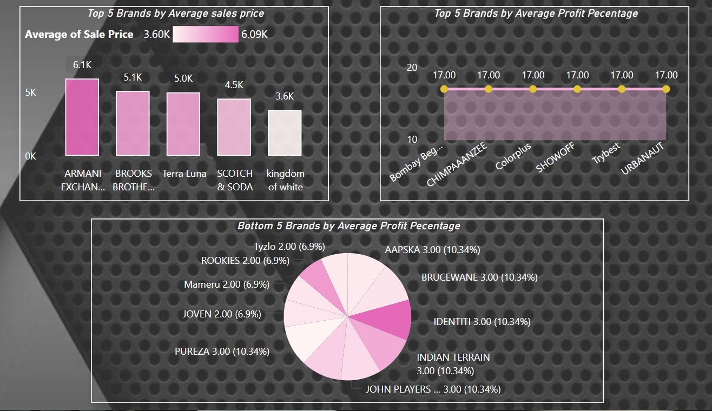
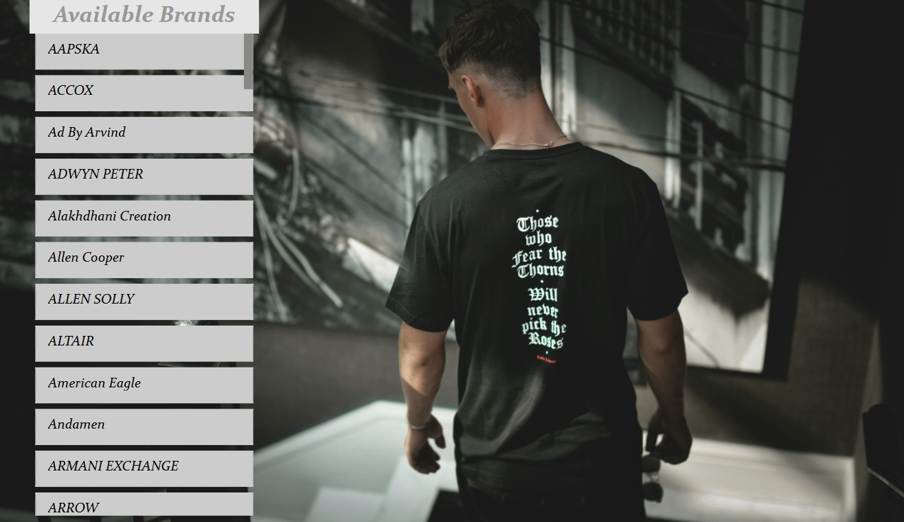

# 👕 Men's T-shirt Brands Dashboard

This project presents an interactive Power BI dashboard that analyzes the T-shirt Brands dataset from the Udemy course, using data hosted in Azure SQL Database. 
---

## Project Overview

- **Goal**: Analyze the T-shirt Brands dataset using visual dashboards.
- **Tools Used**:
  - Microsoft Power BI 
  - Azure SQL Database 
  - SQL Server 
  - DAX, T-SQL 

---

## 🗂️ Data Sources

- The initial Men_Tshirt dataset contains the following columns:
  - `Brand` 
  - `Title`
  - `Original Price`
  - `Sale Price`

- The data is loaded to Azure SQL Database through SQL Server (using 'connect to engine' functionality).


---

## 🧹 Data cleaning and processing 

-  **Removing Currency signs from Price columns**
 - Using DAX functions:
    -  **Filtering N/A values**
    -  **Adding Discount % column**
    -  **Creating Profit % column** as a random int value between 1 and 17 
    -  **Adding Cost Price column** as a price paid to the supplier (without adding profit margin)

---

## 🔍 Key Features

-  **List of available brands** using multi-row card.
-  **Top 5 Brands** by average discount percentage, distinct title count, average sales price, average profit percentage. 
-  **Bottom 5 Brands** by average profit percentage.

 

 

 
---


## ⚙️ Setup Instructions

### 1. Clone this Repository
```bash
git clone https://github.com/marianaprytula/T-shirt_Brands_analysis.git